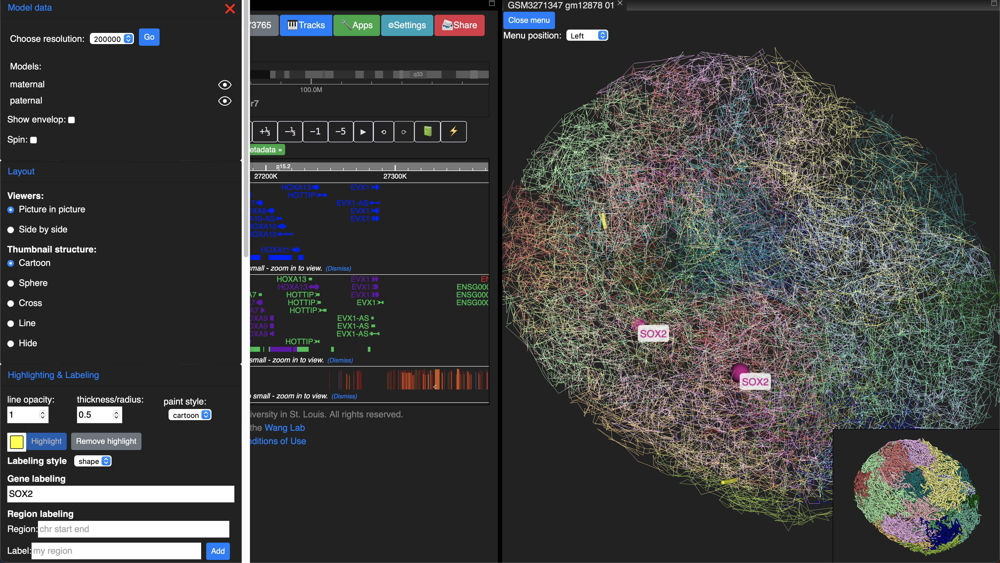
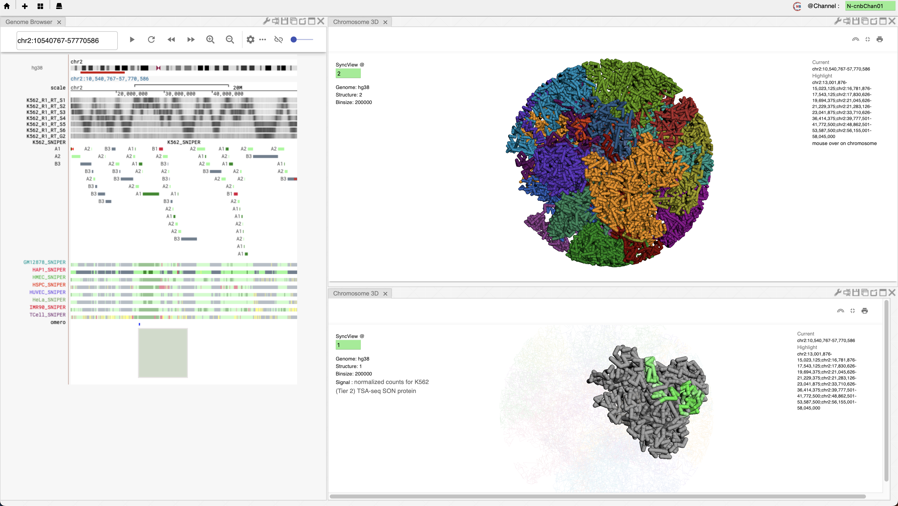
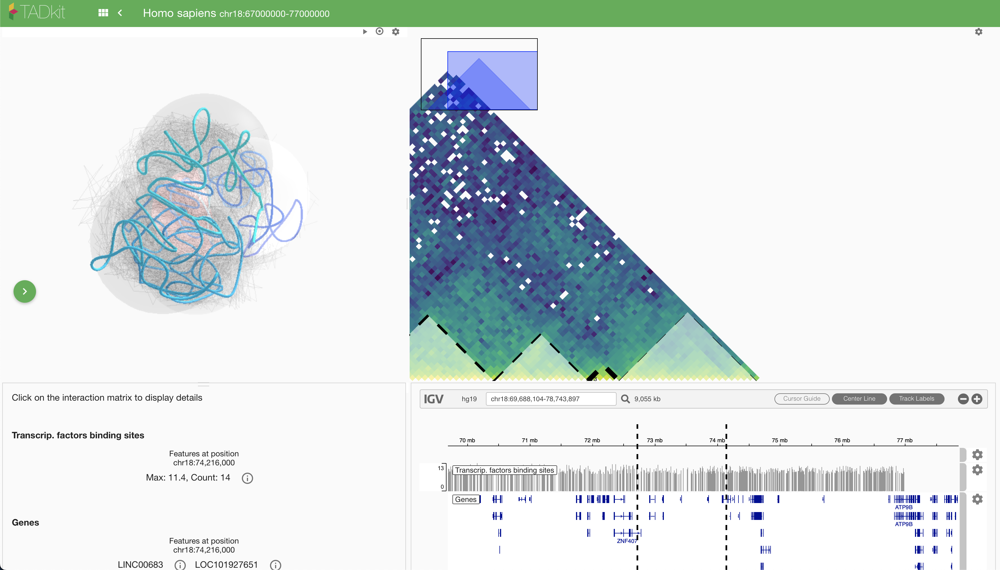
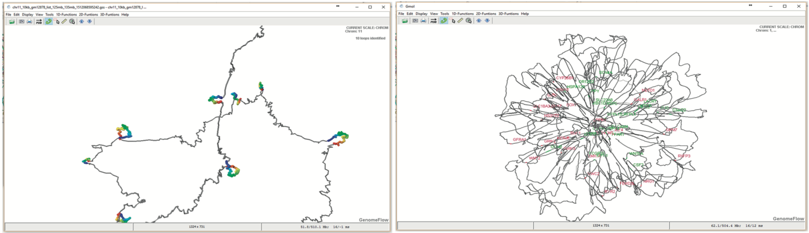
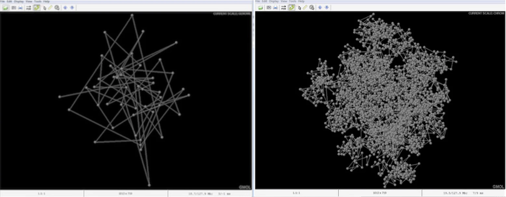

# List of 3D genome visualization tools that actually feature 3D data

## Actively developed tools

|Tool Name|Links|Paper|
|---------|---|-----------|
|WashU Epigenome Browser|[live](https://epigenomegateway.wustl.edu)|[Li 2022 NatMet](https://doi.org/10.1038/s41592-022-01550-y), [Li 2022 NAR](https://doi.org/10.1093/nar/gkac238)|
|Nucleome Browser|[live](http://vis.nucleome.org/entry/)|[Zhu 2022 NatMet](https://doi.org/10.1038/s41592-022-01559-3)|

## Maybe active

|Tool Name|Links|Paper|
|---------|---|-----------|
|SpaceWalk|[code](https://github.com/igvteam/spacewalk)||
|CSynth|[web](https://csynth.org), [code](https://github.com/csynth/csynth)|[Todd 2021 Bioinf](https://doi.org/10.1093/bioinformatics/btaa757)||

## Abandoned

|Tool Name|Links|Paper|Last update|
|---------|---|-----------|---|
|HiC-3DViewer|[code](https://github.com/mohamed-amine-guerras/HiC3DViewer)|[Djekidel 2017 QuantBio](https://doi.org/10.1007/s40484-017-0091-8)|Nov 2019 (last commit)|
|TADkit|[code](https://github.com/3DGenomes/TADkit), [live](https://3dgenomes.github.io/TADkit/#/project/loader)|[Serra 2017 CompBio](https://doi.org/10.1371/journal.pcbi.1005665) (related)|
|3DGB|[live](http://3dgb.cs.mcgill.ca/)|[Butyaev 2015](http://dx.doi.org/10.1093/nar/gkv476)|May 2015 (News tab)|
|3Disease||[Li 2016 SciRep](https://doi.org/10.1038/srep34651)||
|Delta|[code](https://github.com/zhangzhwlab/delta), [web](https://delta.ngdc.cncb.ac.cn)|[Tang 2018 Bioinf](https://doi.org/10.1093/bioinformatics/btx805)||
|GenomeFlow|[code](https://github.com/jianlin-cheng/GenomeFlow)|[Trieu 2019 Bioinf](https://doi.org/10.1093/bioinformatics/bty802)|Feb 2019 (last commit)|
|GMOL|[binaries](https://sourceforge.net/projects/gmol/)|[Nowotny 2016 SciRep](https://doi.org/10.1038/srep20802)||
|Genome3D|[web](http://genome3d.org)|[Asbury 2010 BMCBioinf](https://doi.org/10.1186/1471-2105-11-444)||

## Screenshots
### WashU Epigenome Browser

### Nucleome Browser

### SpaceWalk

### TADkit

### GenomeFlow

### 3DGB

### GMOL

